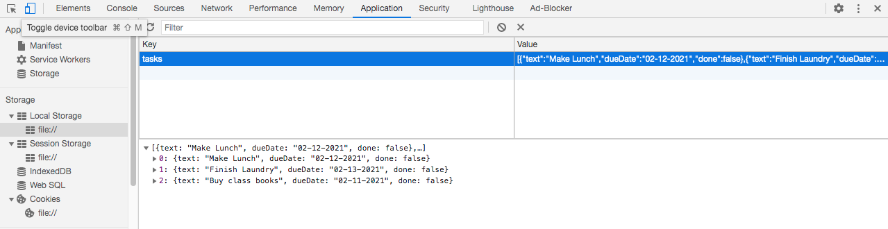
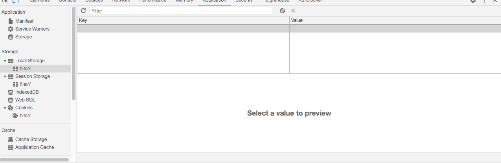

# JSON Data in Local Storage

## Introduction

Before we can use JSON and local storage in conjunction, we must first understand how they work and why they are used. 

JSON, which stands for JavaScript Object Notation is a standard text-based format. It uses key value pairs (keys in key value pairs are always unique to the data set but values can be repeated), stored in plain text and is most commonly used for transmitting data in and between web applications. However, JSON cannot be used to store functions as items like JavaScript objects can. It can be used to store numbers (both whole and decimal), characters, strings and Boolean values. 

Local storage is a persistent(permenant) method of storage within the browser of the computer and stores information locally up to around 5MB. Local storage is used to store information because http is not persistant, when the page is refreshed all data the user has entered is lost. To solve this issue, local stoarage is used to store data that would otherwise be lost to the user and require them to redo it. It also saves time as the website can look at local storage for data and not have to request it from the server.

Local storage also uses key value pairs to store information. 

Using JSON and local storage together, allows websites to store arrays of data under a single local storage key and the JSON data is an array in string form, meaning it has been converted into a string. This data has no expiration date and will stay there until deleted by the user or the website no longer has any need of it and deletes the data. 


## Tutorial

In order to put a JSON object into local storage, we first need to create a JSON object that contains meaningful information. 

The term 'let' declares the scope of array that is being declared. As we will only be using this array in one function it is the appropriate declaration. However, if the array needed to be available globally, meaning anywhere inside of the file, the type 'var' would be used instead. "tasks" will be the name of the array, which will store a list of tasks that need to be completed by the user. The square brackets dictate the start and end of the array. In this example we have declared an empty array with an empty object inside of it, denoted by the empty square brackets.

```javascript
    let tasks = [{}]
```

Within each object there are sets of key-value pairs where each key must be unique and comes before the colon. The value can be of any data type such as string, character, integer or Boolean. Each key value pair is separated by a comma except for the last pair which has no trailing comma. 

```javascript
   {key1 : "value1",
    key2 : 23,
    key3: false}

```
Putting all of this together this code creates an object called tasks, that contains 3 arrays where each array contains information about a task to be completed. 

```javaScript
   let tasks = [
        {text: "Make Lunch",
        dueDate: "02-12-2021",
        done: false},
        {text: "Finish Laundry",
        dueDate: "02-13-2021",
        done: false},
         {text: "Buy class books",
        dueDate: "02-11-2021",
        done: false}
        ]
```

While it is useful to create such objects, being able to hard code them in, is rather useless and impractical. In this example we are using an object to store a list of tasks, so we need to be able to add tasks to this list and remove them as well.  

To add a task, create a new array of key value pairs and then add it to the tasks object using the push() function. 

```javascript
    let taskToAdd = {text: "Pick up dry cleaning",
                     dueDate: 02-16-2021,
                     done: false}
    tasks.push(taskToAdd)
```

To remove a task from the tasks object, use the splice function, where index is the position of the task in the object and count is how many items you want to remove.

```javascript

    tasks.splice(index, count)
```

For example, if you wanted to remove the second item in the object the index would be 2 because JavaScript objects are 0 based, meaning the first element is at index 0. Only 2 element of the array needs to be removed so the count would be one.

```javascript

    tasks.splice(1,1)
```

Now that creating, adding and deleting items from a JavaScript object have been covered, the object needs to be converted into a JSON object. To convert an object into a JSON object JSON.stringify(object) is called. This function simply turns the object into a string which is then ready to be stored in local storage. 

```javascript

    let jsonString = JSON.stringify(tasks)

```
Local storage also uses key-value pairs to store and retrieve data. In the example the key will be 'tasks' and the value will be our jsonString variable, which is currently assigned to a string version of the tasks array.

Security is a vital thing to consider when storing data in local storage, especially given that anyone using the browser on the computer storing the data can look at the data. Storing information like passwords, names or any other sensitive information should not be stored here in plain text. Avoid storing it in local storage if possible. However, it can be done if the data is encrypted. See the references for more information on doing this.

```javascript

    localStorage.setItem('tasks', jsonString)

```
After this has been executed, verify in the browser if it has been successful. In Google Chrome that can be accomplished by going to the application tab in the inspector. Once there select local storage from the left hand side to view its contents.



To retrieve data from local storage, use the getItem(key) function. Where the key value is the value set when setItem(key) was called. In this case it would be 'tasks'.

```javascript

    let tasksJSON = localStorage.getItem('tasks')

```

Once the data has been retrieved it needs to be converted back into an array to make it useful using the JSON.stringify(value). The data is now back in array format and can be searched or modified in any way needed. 

```javascript

    let tasks = JSON.stringify(tasksJSON)

```

Once the data in local storage is no longer needed it needs to be removed. This can be done in 2 ways. The first is to remove an item using its key value which only removes the one key-value pair. The other is to remove all data stored in local storage which can be called when all the data is no longer needed. 

To clear just one key-value pair, call the removeItem(key) function on local storage.

```javascript

    localStorage.removeItem('tasks')

```

To clear all data in local storage call the clear() function. 

```javascript

    localStorage.clear()

```

After clearing it using either method verify the result by checking that the value(s) have been removed. In Google Chrome this can be done by going to the application tab in the inspector. The concerned value(s) should no longer be there. 



## Tips & Tricks

Remember to use logical and sensible names for everything. It makes it easier to remember and allows other programmers to read your code with more ease.

Debugging can often take a lot of a programmer’s time and is often quite frustrating. Here are some tips and tricks to help avoid problems and spot them more easily when they occur. 

* Function calls are case sensitive. Make sure you check proper capitalization of the functions you are using.
* variables are also case sensitive, ensure when using, setting or getting variables that the cases match. Tasks is not the same as tasks to a computer. 
* Use console.log() to output data to the console. This can allow you to see where errors are occurring and what data is actually being used.
* Use the inspector in the browser to look at the values stored in local storage and check they match what should be there.

## Additional Resources

The following links are great beginner resources provided by W3School and explain the basic process of:

* Setting local storage items - https://www.w3schools.com/jsref/met_storage_setitem.asp
* Getting local storage items - https://www.w3schools.com/jsref/met_storage_getitem.asp
* Removing local storage items - https://www.w3schools.com/jsref/met_storage_removeitem.asp
* Clearing local storage - https://www.w3schools.com/jsref/met_storage_clear.asp

The complete guide to local storage is an excellent reference for further examination of local storage and a comparison against session storage. I would recommend getting comfortable with the basic concepts, by reading this tutorial and the above references before moving on.
* https://blog.logrocket.com/localstorage-javascript-complete-guide/  

* This article elaborates on how sensitive data should be stored by web applications - https://beaglesecurity.com/blog/article/how-to-store-and-secure-sensitive-data-in-web-applications.html